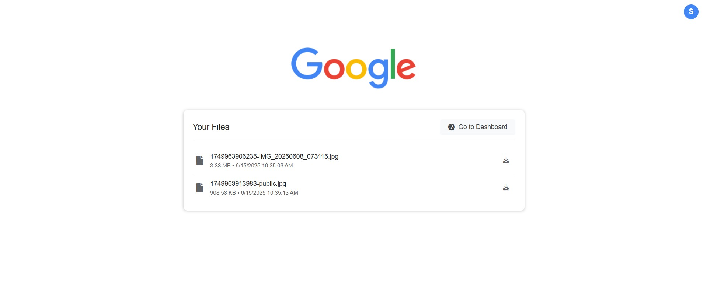

# VaultX

VaultX is a disguised file wallet that can appear as a standard Google search page or other popular platforms like Reddit, YouTube, or any template of your choice. It serves as a secure repository for your code files that can be hosted publicly and accessed from anywhere in the world through the internet.

<p align="center">
  
</p>

## 🚀 Features

- **Disguised Interface**: Appears as a standard search page or social media platform, hiding its true functionality
- **Multiple Templates**: Choose from various templates including Google, Reddit, YouTube, and more
- **Secure File Access**: Access your private code repository from anywhere in the world
- **Keyword Activation**: Use the keyword "ignite" to activate the file search functionality
- **Dark/Light Mode Support**: Automatically adapts to system preferences
- **Responsive Design**: Works across all devices
- **"I'm Feeling Lucky"**: Instantly download the first matching file
- **File Type Identification**: Automatically detects and displays file extensions

## 🛠️ Technologies Used

- **Frontend**: HTML5, CSS3, JavaScript (Vanilla)
- **Backend**: Node.js, Express.js
- **File System**: Node.js fs module
- **Deployment**: Compatible with Heroku, Vercel, Netlify, or any Node.js hosting
- **Version Control**: Git
- **Package Management**: npm

## 📋 Prerequisites

- Node.js (v18.x recommended)
- npm (comes with Node.js)

## 🛠️ Installation

1. Clone the repository:
   ```
   git clone https://github.com/yourusername/VaultX.git
   cd VaultX
   ```

2. Install dependencies:
   ```
   npm install
   ```

3. Start the server:
   ```
   npm start
   ```

4. For development with auto-restart:
   ```
   npm run dev
   ```

5. Access the application at `http://localhost:3000`

## 💻 Usage

1. **Regular Search**: Type any query and press Enter or click "Search" to perform a Google search (maintains the disguise)
2. **File Access**: Type "ignite" followed by your search term to search for your private files
   - Example: `ignite javascript` will search for JavaScript files in your repository
3. **Download Files**: Click on the file name or the "Download" button to download a file
4. **Quick Download**: Use "I'm Feeling Lucky" to instantly download the first matching file
5. **Template Selection**: Modify the HTML/CSS to switch between different platform templates

## 📁 Project Structure

- `/public` - Contains the frontend assets and HTML
- `/codes` - Repository for your private files that can be searched and downloaded
- `server.js` - Express server that handles API requests and serves the application

## 🔍 How It Works

1. The server provides two main API endpoints:
   - `/api/search` - Searches for files based on a query
   - `/api/download` - Handles file downloads

2. When a user enters a search query:
   - If it starts with "ignite", the application searches the private file repository
   - Otherwise, it redirects to the appropriate search engine, maintaining the disguise

3. Search results display file names, types, and download options

## 🌟 What Makes VaultX Different

VaultX offers a unique approach to file storage and retrieval:

- **Stealth Access**: Unlike traditional file storage services that are obvious in their purpose, VaultX disguises itself as a familiar web platform
- **Public Hosting with Private Access**: Can be hosted on public servers but files are only accessible to those who know the activation keyword
- **No Account Required**: Access your files without logging in, just use the secret keyword
- **Customizable Templates**: The interface can be customized to mimic different platforms to maintain the disguise

## 🎨 Available Templates

VaultX can be customized to use different templates:

1. **Google Search (Default)**: The classic Google search interface
2. **Reddit**: Mimics the popular social news platform
3. **YouTube**: Resembles the video-sharing platform
4. **Custom**: Create your own template to match your specific needs or mimic any other platform

## 📱 Screenshots





## 🔧 Customization

You can customize the application by:

1. Adding your code files to the `/codes` directory
2. Modifying the search keyword (default is "ignite") in the JavaScript code
3. Adjusting the UI colors and styles in the CSS variables
4. Creating new templates by modifying the HTML/CSS
5. Adding your own logo to personalize the application

## 🤝 Contributing

Contributions are welcome! Please feel free to submit a Pull Request.

## 📄 License

This project is open source and available under the [MIT License](LICENSE).

## ❓ Support

For support, please open an issue in the GitHub repository.

---

Made with ❤️ by Siddharth Shinde